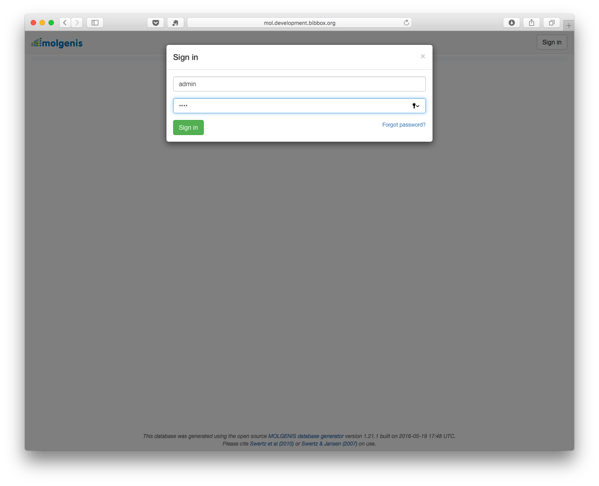
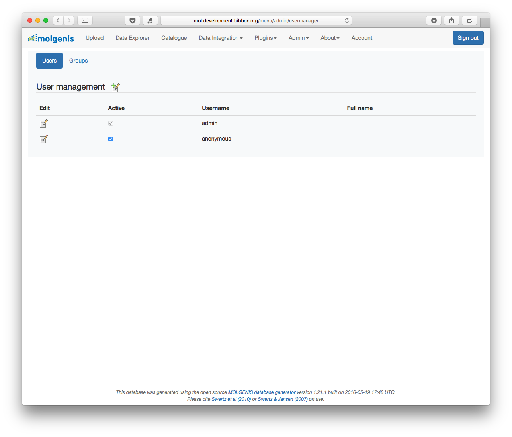

## Molgenis Installation Instructions 

*## Installation Instructions 

* Start Molgenis

In the first start TOMCAT and the dabase are setup. Be patient this can take some up to 5 minutes (its a huge app). The last message in the log should be something like this

'''
16-Nov-2016 13:49:32.173 INFO [main] org.apache.catalina.startup.Catalina.start Server startup in 238399 ms
'''

* Log in with the username admin and the password you specified in the installation 
If you forget the password, just loock in the Install Log in the Apps admin dashboard. 

* Make all further configuration steos within the Molgenis app.

* Make all further configuration steos within the Molgenis app. Further information can be found here http://molgenis.github.io/documentation/.

## After the installation

Have a nice ride with the Admins youngtimer.

